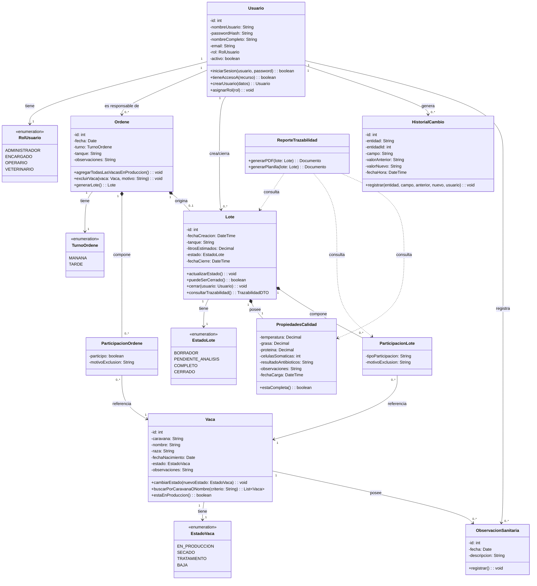
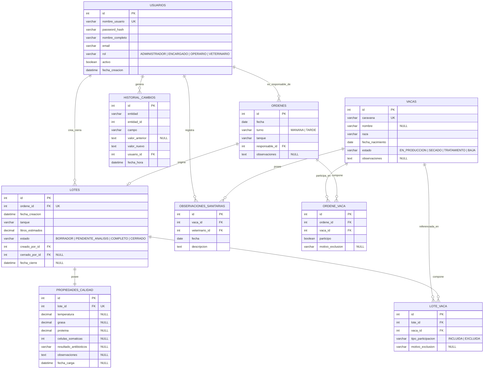

# Práctico ADA — TamboTrace: Modelado UML y MER

### Ingeniería de Software | ADA

---

> Este práctico toma el caso **TamboTrace** desarrollado en [proyecto_scrum_trazabilidad_lechera.md](proyecto_scrum_trazabilidad_lechera.md) (requerimientos funcionales RF1–RF15, no funcionales RNF1–RNF12, épicas EP1–EP8 e historias de usuario HU1–HU21) y aplica las herramientas de la Unidad 2 de [ADA.md](../Teoricos/ADA.md): diagrama de clases UML y Modelo Entidad-Relación (MER).
>
> El objetivo no es "inventar" un diseño nuevo, sino **derivar** cada clase, atributo, método, relación y tabla directamente de un requerimiento o historia de usuario ya relevado. Cada elemento del modelo incluye su justificación y el código de origen (RFx, RNFx, HUx).

---

## 1. Objetivo del práctico

1. Identificar las entidades del dominio a partir de los RF y las HU de TamboTrace.
2. Construir el **diagrama de clases UML** (atributos + métodos + relaciones + cardinalidades) en formato mermaid.
3. Construir el **MER** (entidades, campos con tipo de dato, claves primarias/foráneas, cardinalidades) en formato mermaid.
4. Justificar **cada** clase, atributo, método, relación y tabla con su requerimiento o historia de usuario de origen.
5. Analizar paso a paso cómo la estructura propuesta resuelve el circuito real: registrar vaca → registrar ordeñe → crear lote → cargar calidad → cerrar lote → consultar trazabilidad.

---

## 2. Metodología de análisis (paso a paso)

Se aplicó el método de derivación en cinco pasos:

| Paso | Técnica | Resultado |
|---|---|---|
| 1 | Sustantivos relevantes en RF y HU → candidatos a **clase/entidad** | Vaca, Ordeñe, Lote, Usuario, PropiedadesCalidad, HistorialCambio, ObservacionSanitaria |
| 2 | Datos mencionados explícitamente por RF/HU para cada sustantivo → **atributos** | Ej.: RF3 enumera caravana, nombre, raza, fecha de nacimiento, estado, observaciones para Vaca |
| 3 | Verbos de acción en RF/HU asociados a cada sustantivo → **métodos** | Ej.: RF11 "cerrar un lote" → método `cerrar()` en clase `Lote` |
| 4 | Relación entre dos sustantivos + palabras que indican cardinalidad ("un ordeñe tiene varias vacas", "cada vaca puede tener varias observaciones") → **asociaciones y multiplicidades** | Ordeñe 1 — 0..* Vaca (vía ParticipacionOrdene) |
| 5 | Cada clase persistente del diagrama UML se traduce a una tabla; los atributos se tipifican; las asociaciones muchos-a-muchos se convierten en tablas intermedias | Diagrama de clases → MER |

Este método asegura que **no exista ningún elemento del modelo sin origen en un requerimiento**, cumpliendo el criterio de **trazabilidad** exigido por IEEE 830 (ver [ADA.md §1.2](../Teoricos/ADA.md)).

---

## 3. Tabla de trazabilidad general: entidad ↔ requerimiento ↔ historia de usuario

| Entidad/Clase | RF de origen | RNF relacionados | HU de origen | Épica |
|---|---|---|---|---|
| `Usuario` / `RolUsuario` | RF1, RF2 | RNF4, RNF5 | HU1, HU2 | EP1 |
| `Vaca` / `EstadoVaca` | RF3, RF4, RF13 | RNF1, RNF10 | HU3, HU4, HU5 | EP2 |
| `ObservacionSanitaria` | RF3 (observaciones) | RNF5 | HU15 | EP2 |
| `Ordene` / `TurnoOrdene` | RF5 | RNF2, RNF3, RNF12 | HU6, HU19 | EP3 |
| `ParticipacionOrdene` | RF6, RF7 | RNF2 | HU7, HU8, HU19 | EP3 |
| `Lote` / `EstadoLote` | RF8, RF11 | RNF10, RNF12 | HU9, HU12, HU20, HU21 | EP4 |
| `PropiedadesCalidad` | RF9, RF10 | RNF10 | HU10, HU11 | EP5 |
| `ParticipacionLote` | RF12 | — | HU13 | EP4/EP6 |
| `HistorialCambio` | RF15 | RNF6, RNF7 | HU16, HU17 | EP7 |
| `ReporteTrazabilidad` (clase de servicio, sin persistencia propia) | RF12, RF14 | RNF11 | HU13, HU14 | EP6 |

> Nota metodológica: `ReporteTrazabilidad` no se traduce en tabla en el MER (sección 7) porque no almacena datos propios — **lee** datos de `Lote`, `ParticipacionLote` y `PropiedadesCalidad` y los proyecta en PDF/planilla (RF14). Se modela como clase en UML porque tiene comportamiento, pero no tiene estado persistente propio.

---

## 4. Diagrama de clases UML

---

## 5. Justificación de clases, atributos y métodos

### 5.1 `Usuario` / `RolUsuario`

| Elemento | Justificación |
|---|---|
| Clase `Usuario` | RF1 "iniciar sesión con usuario y contraseña"; RF2 "gestionar usuarios con diferentes roles". |
| `nombreUsuario`, `passwordHash` | RF1 — necesarios para autenticación. Se guarda `passwordHash` y no la contraseña en texto plano, por RNF5 (protección de datos sensibles mediante autenticación). |
| `rol: RolUsuario` | RF2, RNF4 "acceso mediante roles: administrador, encargado, operario y veterinario". Los cuatro valores del enum provienen textualmente de RNF4. |
| `activo: boolean` | Deriva de RF2 (gestión de usuarios) — un administrador debe poder dar de baja el acceso de un usuario sin borrar su historial (necesario para que `HistorialCambio.usuario` siga siendo válido). |
| `iniciarSesion()` | RF1, HU1. |
| `tieneAccesoA(recurso)` | RNF4 y la restricción explícita del cliente: *"el veterinario... no debería ver información económica"* (entrevista, pregunta 7). |
| `crearUsuario()`, `asignarRol()` | RF2, HU2. |

### 5.2 `Vaca` / `EstadoVaca` / `ObservacionSanitaria`

| Elemento | Justificación |
|---|---|
| Clase `Vaca` | RF3, HU3. |
| `caravana`, `nombre`, `raza`, `fechaNacimiento`, `estado`, `observaciones` | Copiados literalmente de RF3: *"registrar vacas con número de caravana, nombre opcional, raza, fecha de nacimiento, estado y observaciones"*. `nombre` se modela opcional porque la entrevista aclara: *"Algunas también tienen nombre interno, pero el número de caravana es lo principal"*. |
| `estado: EstadoVaca` (EN_PRODUCCION, SECADO, TRATAMIENTO, BAJA) | RF4 enumera exactamente estos cuatro estados. |
| `cambiarEstado()` | RF4, HU5. |
| `buscarPorCaravanaONombre()` | RF13, HU4. |
| `estaEnProduccion()` | Necesario para implementar HU19 ("agregar automáticamente todas las vacas en producción a un ordeñe"), agregada en el Sprint 2 tras la corrección del cliente. |
| Clase `ObservacionSanitaria` | HU15 "Como veterinario, quiero registrar observaciones sanitarias de una vaca". Se modela como clase separada (no como campo de texto en `Vaca`) porque el cliente pidió trazabilidad temporal (varias observaciones a lo largo del tiempo) y porque solo el veterinario debería cargarlas (restricción de rol de la entrevista). |

### 5.3 `Ordene` / `TurnoOrdene` / `ParticipacionOrdene`

| Elemento | Justificación |
|---|---|
| Clase `Ordene` | RF5, HU6. |
| `fecha`, `turno`, `tanque` | RF5: *"registrar ordeñes indicando fecha, turno, responsable y tanque asociado"*. `responsable` se modela como asociación a `Usuario` (no como atributo de texto) porque RNF7 exige registrar qué usuario hizo el cambio. |
| `turno: TurnoOrdene` (MANANA, TARDE) | La entrevista da el ejemplo concreto "ordeñe de la mañana"; el dominio lechero estándar de dos ordeñes diarios justifica el enum cerrado en vez de texto libre, mejorando la verificabilidad (IEEE 830). |
| Clase `ParticipacionOrdene` (clase de asociación entre `Ordene` y `Vaca`) | RF6 "seleccionar las vacas participantes" + RF7 "excluir vacas... indicando motivo". Se necesita una clase intermedia (no una simple relación) porque cada participación lleva un dato propio: `participo` y `motivoExclusion`. |
| `agregarTodasLasVacasEnProduccion()` | HU19, incorporada como corrección en el Sprint Review 2 porque *"seleccionar vaca por vaca nos lleva demasiado tiempo"*. |
| `excluirVaca(vaca, motivo)` | RF7, HU8. |
| `generarLote()` | RF8 "crear lotes de leche a partir de un ordeñe". |

### 5.4 `Lote` / `EstadoLote` / `PropiedadesCalidad` / `ParticipacionLote`

| Elemento | Justificación |
|---|---|
| Clase `Lote` | RF8, HU9. Definido por el cliente en la entrevista: *"la leche producida en una fecha y turno determinado, asociada a un tanque o destino"*. |
| `tanque`, `litrosEstimados` | RF9 ("litros estimados") y RF5 (tanque), confirmados en HU10. |
| `estado: EstadoLote` (BORRADOR, PENDIENTE_ANALISIS, COMPLETO, CERRADO) | Agregado como corrección del Sprint 3 (HU20): el cliente pidió diferenciar *"datos cargados en el momento del ordeñe"* de *"datos que llegan después del laboratorio"*, para que quede claro cuándo un lote está incompleto. |
| `puedeSerCerrado()` | HU21 "quiero que el sistema impida cerrar un lote si faltan datos", agregada junto con HU20 en el mismo Sprint Review. |
| `cerrar(usuario)` | RF11, HU12. Recibe `usuario` porque RNF7 exige registrar quién hizo el cambio crítico. |
| `consultarTrazabilidad()` | RF12, HU13: debe devolver fecha, turno, tanque, responsable, vacas incluidas, vacas excluidas y propiedades registradas — es decir, recorre `Ordene`, `ParticipacionLote` y `PropiedadesCalidad`. |
| Clase `PropiedadesCalidad` (1 a 1 con `Lote`, no atributos sueltos en `Lote`) | RF9 enumera: *"litros estimados, temperatura, grasa, proteína, células somáticas y resultado de antibióticos"*; RF10 exige que estos valores puedan completarse **después** de creado el lote (llegan del laboratorio, según la entrevista). Separarla en su propia clase permite que `Lote` exista en estado BORRADOR antes de tener datos de calidad, y que `estaCompleta()` valide RF10/HU21 sin mezclar responsabilidades con `Lote`. |
| `estaCompleta()` | Usado por `Lote.puedeSerCerrado()` — HU21. |
| Clase `ParticipacionLote` (clase de asociación entre `Lote` y `Vaca`, separada de `ParticipacionOrdene`) | RF12 exige que la consulta de un lote muestre "vacas incluidas" y "vacas excluidas" **del lote**, no del ordeñe en abstracto. Se decide duplicar la información como una "foto" (snapshot) tomada al crear el lote (`generarLote()` la copia desde `ParticipacionOrdene`) en lugar de navegar siempre a través de `Ordene`. **Justificación de diseño:** RF11 y RF15 exigen que un lote cerrado no pueda modificarse y que exista historial de cambios; si `ParticipacionLote` solo fuera una consulta indirecta sobre `Ordene`, un cambio posterior en el ordeñe alteraría silenciosamente la trazabilidad de un lote ya cerrado, violando RF11. El snapshot es la forma de garantizar la **inmutabilidad** de un lote cerrado. |

### 5.5 `HistorialCambio`

| Elemento | Justificación |
|---|---|
| Clase `HistorialCambio` | RF15 "registrar un historial de cambios sobre lotes cerrados o datos críticos"; RNF7 "registrar fecha, hora y usuario en cambios críticos"; HU16. |
| `entidad`, `entidadId` | Se modela de forma genérica (no una tabla de historial por cada clase) porque RF15 pide auditar "datos críticos" en general y el Sprint 4 acotó el alcance a "cambios de estado críticos" (tabla de la sección 26 del proyecto original), evitando sobre-diseño para una primera versión de 80 puntos. |
| `usuario` (asociación) | RNF7 exige saber **quién** hizo el cambio. |
| `fechaHora` | RNF7 exige **cuándo**. |

### 5.6 `ReporteTrazabilidad`

| Elemento | Justificación |
|---|---|
| Clase de servicio sin atributos persistentes | RF14 "generar reportes exportables en PDF o planilla"; HU14. Se modela sin estado propio porque el Sprint 4 decidió entregar *"formato PDF básico, sin personalización avanzada"* — no hay configuración de reporte que deba persistirse en esta primera versión. |
| `generarPDF()`, `generarPlanilla()` | RF14 menciona explícitamente ambos formatos. |

---

## 6. Justificación de las relaciones y multiplicidades

| Relación | Multiplicidad | Tipo UML | Justificación |
|---|---|---|---|
| `Usuario` — `Ordene` | 1 a 0..* | Asociación | Un responsable (`Usuario`) puede registrar muchos ordeñes; RF5 exige guardar el responsable de cada ordeñe. |
| `Usuario` — `Lote` | 1 a 0..* | Asociación | Un usuario (encargado) crea y cierra lotes; RF11/RNF7 exigen saber quién cerró el lote. |
| `Ordene` — `ParticipacionOrdene` — `Vaca` | 1 ordeñe a 0..* participaciones; cada participación referencia 1 vaca | Composición (`Ordene *-- ParticipacionOrdene`) | Una participación **no tiene sentido sin su ordeñe** (si se elimina el ordeñe, se eliminan sus participaciones) → composición, justificado por RF6/RF7. La relación hacia `Vaca` es una simple asociación porque la vaca sigue existiendo aunque se borre el ordeñe. |
| `Ordene` — `Lote` | 1 a 0..1 | Composición | El cliente define el lote como *"la leche producida en una fecha y turno... a partir de un ordeñe"* (RF8): un lote siempre se origina en exactamente un ordeñe, y no puede existir sin él. Se usa **composición** y no agregación porque conceptualmente el lote hereda su identidad temporal (fecha/turno/tanque) del ordeñe que lo originó. |
| `Lote` — `PropiedadesCalidad` | 1 a 1 | Composición | RF9/RF10: las propiedades de calidad no tienen sentido fuera del lote al que describen, y se crean vacías (BORRADOR) al crear el lote — existencia dependiente. |
| `Lote` — `ParticipacionLote` — `Vaca` | 1 lote a 0..* participaciones; cada una referencia 1 vaca | Composición hacia `ParticipacionLote`, asociación hacia `Vaca` | Igual razonamiento que `Ordene`–`ParticipacionOrdene`, pero exigido directamente por RF12 (consulta de trazabilidad debe mostrar vacas incluidas/excluidas **del lote**). |
| `Vaca` — `ObservacionSanitaria` | 1 a 0..* | Asociación | HU15: una vaca puede acumular varias observaciones sanitarias en el tiempo; la observación no existe sin la vaca pero se modela como asociación (no composición) porque en el alcance actual no se elimina el historial sanitario aunque la vaca cambie de estado. |
| `Usuario` — `HistorialCambio` | 1 a 0..* | Asociación | RNF7: cada entrada de historial debe indicar el usuario responsable. |
| `ReporteTrazabilidad` — `Lote`/`ParticipacionLote`/`PropiedadesCalidad` | dependencia (`..>`) | Dependencia | RF12/RF14: el reporte **lee** datos de estas clases para construir el documento, pero no las posee ni las modifica. |

---

## 7. Modelo Entidad-Relación (MER)

Cada clase persistente del diagrama de clases (sección 4) se traduce a una tabla. Las clases de asociación (`ParticipacionOrdene`, `ParticipacionLote`) se convierten en tablas intermedias porque representan relaciones muchos-a-muchos con atributos propios. `ReporteTrazabilidad` no genera tabla (ver nota de la sección 3).

---

## 8. Justificación de las decisiones del modelo relacional

| Decisión de diseño | Justificación | Origen |
|---|---|---|
| `usuarios.password_hash` en vez de contraseña en texto plano | RNF5 "los datos sensibles deben protegerse mediante autenticación y autorización por rol" | RNF5 |
| `usuarios.rol` como campo cerrado (no tabla `roles` separada) | El alcance define exactamente 4 roles fijos (RNF4); el cliente no pidió que los roles fueran configurables, así que agregar una tabla `roles` sería sobre-diseño para una primera versión de 80 puntos (ver "ajuste de alcance", sección 16 del documento original) | RNF4, sección 16 del proyecto |
| `vacas.caravana` como `UNIQUE` (UK) | RF13 "buscar vacas por caravana" y la entrevista: *"el número de caravana es lo principal"* — debe ser un identificador único y confiable | RF3, RF13, entrevista |
| Tabla intermedia `ORDENE_VACA` (en vez de campo `vaca_ids` en `ORDENES`) | RF6/RF7 exigen guardar, por cada vaca, si participó o el motivo de exclusión — es una relación muchos-a-muchos con atributos propios, que en un modelo relacional exige tabla intermedia | RF6, RF7 |
| `lotes.ordene_id` con restricción `UNIQUE` | RF8 modela que un lote se crea "a partir de un ordeñe" (relación 1 a 0..1 en el UML) — la unicidad en el MER impide crear dos lotes desde el mismo ordeñe, evitando duplicados de trazabilidad | RF8 |
| Tabla `PROPIEDADES_CALIDAD` separada de `LOTES` con relación 1 a 1 | RF10 exige poder crear el lote **antes** de tener los datos de calidad (llegan del laboratorio); separarlas en tablas distintas permite que `lotes` exista con `propiedades_calidad` en NULL/incompleto sin usar una fila "a medio llenar" en la tabla principal | RF9, RF10, corrección Sprint 3 |
| Casi todos los campos de `PROPIEDADES_CALIDAD` son `NULL` por defecto | El cliente aclaró: *"Algunos se cargan en el momento del ordeñe y otros llegan después del laboratorio"* — el modelo debe permitir campos vacíos temporalmente | Entrevista, RF10 |
| Tabla intermedia `LOTE_VACA` como copia (snapshot) de `ORDENE_VACA`, no una vista/consulta | RF11 "cerrar un lote para evitar modificaciones no autorizadas" + RF15 "historial de cambios sobre lotes cerrados": si `LOTE_VACA` fuera solo una consulta sobre `ORDENE_VACA`, modificar el ordeñe después de cerrar el lote alteraría la trazabilidad ya cerrada, violando la regla de negocio | RF11, RF12, RF15 |
| `lotes.estado` con 4 valores (BORRADOR, PENDIENTE_ANALISIS, COMPLETO, CERRADO) | Agregado literalmente por HU20, corrección solicitada en el Sprint Review 3 | HU20 |
| Regla de negocio "no cerrar lote si faltan datos obligatorios" implementada como validación de aplicación (`Lote.puedeSerCerrado()`) y no como constraint SQL | HU21 pide impedir el cierre cuando faltan datos, pero cuáles campos son "obligatorios" depende de reglas de negocio que pueden cambiar (ej. temperatura obligatoria, pero resultado de antibióticos puede demorar) — una constraint rígida de base de datos sería difícil de modificar, violando el criterio "modificable" de IEEE 830 | HU21, RNF10 (crecer sin rediseñar la base) |
| `historial_cambios` genérica (`entidad` + `entidad_id`) en vez de una tabla de historial por cada entidad | El Sprint 4 acotó el alcance: *"se aplica solo a lotes y cambios de estado críticos"* — una tabla genérica cubre ese alcance reducido sin comprometer RNF10 (poder crecer sin rediseñar la base) si en el futuro se audita otra entidad | RF15, RNF7, RNF10, decisión de alcance Sprint 4 |
| Ninguna tabla de "reporte" | RF14 se resuelve leyendo `lotes` + `lote_vaca` + `propiedades_calidad` en el momento de exportar; no hay estado que persistir en esta primera versión (reportes básicos sin personalización) | RF14, decisión de alcance Sprint 4 |
| No hay tabla para sincronización offline ni RFID | Explícitamente fuera de alcance de la primera versión (sección 10 del documento original) | Exclusiones de alcance |

---

## 9. Análisis paso a paso de la estructura de la solución

A continuación se recorre el circuito operativo real descrito por el cliente en la entrevista, mostrando cómo cada paso se apoya en el modelo de datos definido arriba.

### Paso 1 — Alta de vacas (EP2)

`Vaca` se crea con `estado = EN_PRODUCCION` por defecto. RF3/HU3 permiten cargar caravana, nombre, raza, fecha de nacimiento y observaciones. El encargado puede luego usar `Vaca.cambiarEstado()` (RF4/HU5) cuando una vaca entra en tratamiento o secado — este cambio de estado es justamente lo que después decide si la vaca aparece en la lista de "vacas en producción" que ofrece HU19.

**Por qué importa para lo que sigue:** el `estado` de la vaca es la única fuente de verdad que usa el paso 2 para saber qué animales incluir automáticamente en un ordeñe.

### Paso 2 — Registro de un ordeñe (EP3)

Se crea un `Ordene` con fecha, turno, tanque y responsable (RF5/HU6). El operario ejecuta `agregarTodasLasVacasEnProduccion()` (HU19), que crea una fila en `ORDENE_VACA` con `participo = true` por cada `Vaca` cuyo `estado = EN_PRODUCCION`. Si una vaca en tratamiento no debe participar, el operario llama a `excluirVaca(vaca, motivo)` (RF7/HU8), que actualiza esa fila a `participo = false` y guarda `motivo_exclusion`.

**Vínculo con la corrección de Sprint 2:** este flujo reemplaza directamente la selección manual "vaca por vaca" que el cliente rechazó en el Sprint Review 2, confirmando que HU19 no es una función nueva sino una corrección de usabilidad sobre RF6/RF7.

**Por qué importa para lo que sigue:** `ORDENE_VACA` es la fuente que el paso 3 copia (snapshot) hacia `LOTE_VACA`.

### Paso 3 — Creación del lote (EP4)

`Ordene.generarLote()` (RF8/HU9) crea un `Lote` en `estado = BORRADOR`, copiando `tanque` del ordeñe y dejando `litros_estimados` a cargar (RF9/HU10). En el mismo paso se copian todas las filas de `ORDENE_VACA` hacia `LOTE_VACA` (cada `participo = true` se traduce en `tipo_participacion = INCLUIDA`, cada `participo = false` en `EXCLUIDA` con su motivo). También se crea automáticamente una fila vacía en `PROPIEDADES_CALIDAD` asociada al lote.

**Por qué se copian los datos en vez de solo referenciar el ordeñe:** ver la justificación de la sección 8 (`LOTE_VACA` como snapshot) — es lo que garantiza que RF11/RF15 se cumplan más adelante.

### Paso 4 — Carga de propiedades de calidad (EP5)

En cualquier momento posterior, administración carga valores en `PROPIEDADES_CALIDAD` (temperatura en el momento del ordeñe; grasa, proteína, células somáticas y antibióticos cuando llega el resultado del laboratorio — RF10/HU11). Cada carga puede disparar `Lote.actualizarEstado()`, que recalcula el `estado` del lote: pasa de `BORRADOR` a `PENDIENTE_ANALISIS` cuando tiene litros y tanque pero le faltan propiedades de calidad, y a `COMPLETO` cuando `PropiedadesCalidad.estaCompleta()` es verdadero (HU20).

### Paso 5 — Intento de cierre del lote (EP4)

El encargado invoca `Lote.cerrar(usuario)` (RF11/HU12). Antes de cerrar, el sistema evalúa `puedeSerCerrado()` (HU21): si `PropiedadesCalidad.estaCompleta()` es falso, se rechaza el cierre. Si se permite, `estado` pasa a `CERRADO`, se graba `fecha_cierre` y `cerrado_por_id`, y a partir de ese momento ninguna operación de escritura debe aceptarse sobre `LOTE_VACA` ni `PROPIEDADES_CALIDAD` de ese lote (regla de negocio de RF11, validada en la capa de aplicación, no en la base).

**Vínculo con la corrección de Sprint 3:** HU20 y HU21 nacieron exactamente de este paso, cuando el cliente señaló que *"si alguien mira el lote antes de cargar los análisis, debería quedar claro que está incompleto"*.

### Paso 6 — Consulta de trazabilidad y reportes (EP6)

`Lote.consultarTrazabilidad()` (RF12/HU13) arma la respuesta uniendo `LOTES` + `ORDENES` (fecha, turno, tanque, responsable) + `LOTE_VACA` (vacas incluidas/excluidas) + `PROPIEDADES_CALIDAD`. `ReporteTrazabilidad.generarPDF()`/`generarPlanilla()` (RF14/HU14) toman exactamente esa misma información y la exportan.

**Por qué el diseño soporta esto sin cambios:** toda la información que RF12 exige mostrar ya está modelada como snapshot inmutable desde el paso 3, así que consultar un lote cerrado meses después devuelve siempre el mismo resultado, aunque las vacas hayan cambiado de estado o el ordeñe original se haya modificado — este es el requisito de trazabilidad de fondo que pidió el cliente en la necesidad inicial: *"cuando nos piden información sobre un lote, nos cuesta reconstruir de qué animales salió"*.

### Paso 7 — Auditoría transversal (EP7)

Cada cambio crítico ejecutado en los pasos 2, 3, 4 y 5 (cambio de estado de vaca, exclusión, creación de lote, cierre de lote) puede generar una fila en `HISTORIAL_CAMBIOS` (RF15/RNF7/HU16), registrando `entidad`, `entidad_id`, `campo`, `valor_anterior`, `valor_nuevo`, `usuario_id` y `fecha_hora`. Esto responde directamente a la restricción de seguridad de la entrevista: *"no queremos que cualquier usuario pueda modificar lotes cerrados"*.

---

## 10. Trazabilidad de las correcciones de sprint hacia el modelo

Un punto didáctico central del proyecto original (sección 31, "Lecciones aprendidas") es que **los requerimientos cambiaron al ver el producto funcionando**. El modelo de este práctico ya incorpora esas correcciones directamente, en vez de modelar primero la versión ingenua y corregirla después:

| Corrección solicitada por el cliente | Historia agregada | Elemento del modelo que la resuelve |
|---|---|---|
| "Seleccionar vaca por vaca... lleva demasiado tiempo" (Sprint Review 2) | HU19 | `Ordene.agregarTodasLasVacasEnProduccion()` + `Vaca.estaEnProduccion()` |
| "Necesitamos diferenciar entre datos cargados en el momento del ordeñe y datos que llegan después" (Sprint Review 3) | HU20 | `Lote.estado: EstadoLote` (BORRADOR/PENDIENTE_ANALISIS/COMPLETO/CERRADO) |
| "El sistema impida cerrar un lote si faltan datos" (Sprint Review 3) | HU21 | `PropiedadesCalidad.estaCompleta()` + `Lote.puedeSerCerrado()` |

Esto demuestra en el modelo lo que la sección 31 del proyecto original explica en prosa: **Scrum permite correcciones controladas** — las nuevas historias no reescriben el diseño, se integran como refinamientos de las clases `Ordene`, `Vaca` y `Lote` ya existentes.

---

## 11. Requerimientos no funcionales no representados como clases (y por qué)

No todo RNF se traduce en una clase o tabla; varios son atributos de calidad de la arquitectura, no del modelo de datos. Se documentan aquí para que la trazabilidad quede completa:

| RNF | Cómo se atiende (fuera del modelo de datos) |
|---|---|
| RNF1, RNF2, RNF12 (uso simple en campo, conectividad irregular) | Decisión de interfaz/arquitectura (frontend liviano), no de modelo de datos. |
| RNF3 (respuesta < 3s) | Se atiende con índices en `vacas.caravana`, `ordenes.fecha`, `lotes.estado` — decisión de implementación física de la base, no de diagrama conceptual. |
| RNF6 (respaldos automáticos) | Configuración de infraestructura/hosting (HU17), no una entidad del dominio. |
| RNF8 (disponibilidad en horario de ordeñe), RNF9 (hosting externo) | Decisiones de despliegue, fuera del alcance de UML/MER. |
| RNF10 (crecer sin rediseñar la base) | Se refleja en decisiones de diseño ya justificadas en la sección 8 (roles como campo cerrado pero simple de ampliar, historial genérico, propiedades de calidad separadas). |
| RNF11 (reportes imprimibles) | Responsabilidad de `ReporteTrazabilidad`, ya modelada en la sección 5.6. |

---

## 12. Conclusión

El modelo de clases y el MER presentados no son un diseño genérico de "sistema de trazabilidad": cada clase, atributo, método y tabla fue derivado de una oración concreta de la entrevista, un RF/RNF numerado o una historia de usuario (incluidas las agregadas durante los sprints como corrección). La tabla de trazabilidad de la sección 3 y las justificaciones de las secciones 5, 6 y 8 permiten recorrer el camino inverso: desde cualquier elemento del diagrama hasta el requerimiento que lo originó, cumpliendo el atributo **trazable** que exige IEEE 830 (ver [ADA.md §1.2](../Teoricos/ADA.md)).
